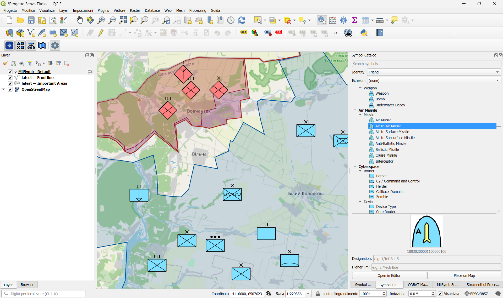

# QGIS APP-6(D)

[](https://qgis.org)
[](LICENSE)
[](qgis_app6d/metadata.txt)

A QGIS 3 plugin providing a full military symbol library following the **APP-6(D)** standard, an ORBAT manager, and temporal layer filtering via the QGIS Temporal Controller.

> **Compatibility:** QGIS 3.16 LTR and later.

---

## Features

- **APP-6(D) Symbol Catalog** — browse and search all NATO symbols by name, SIDC or symbol set; drag and drop onto the map canvas
- **20-character SIDC** — full APP-6(D) encoding
- **Built-in SVG/PNG rendering server** — local HTTP server renders symbols on the fly via [milsymbol.js](https://github.com/spatialillusions/milsymbol)
- **ORBAT Manager** — hierarchical Order of Battle editor with import/export to `.orbat.json`
- **Temporal filtering** — integrates with the QGIS Temporal Controller to show/hide symbols by their temporal extent
- **Layer Manager** — manage named symbol layers, export to JSON

## Screenshots



## Installation

### From ZIP (recommended)

1. Download the latest `qgis_app6d-<version>.zip` from [Releases](https://github.com/intelligeo/qgis-app6d-plugin/releases)
2. Open QGIS → **Plugins → Manage and Install Plugins → Install from ZIP**
3. Select the downloaded ZIP and click **Install Plugin**

### From source

```bash
git clone https://github.com/intelligeo/qgis-app6d-plugin.git
cd qgis-app6d-plugin
python package_plugin.py
```

Then install the generated `qgis_app6d-0.1.0.zip` via the Plugin Manager.

Alternatively, symlink / copy the `qgis_app6d/` folder directly into your QGIS plugin directory:

| Platform | Path |
|---|---|
| Windows | `%APPDATA%\QGIS\QGIS3\profiles\default\python\plugins\` |
| Linux | `~/.local/share/QGIS/QGIS3/profiles/default/python/plugins/` |
| macOS | `~/Library/Application Support/QGIS/QGIS3/profiles/default/python/plugins/` |

## Usage

After enabling the plugin a new **APP-6(D) Toolbar** appears and a **Plugins → APP-6(D)** menu is added.

| Button | Action |
|---|---|
| Symbol Catalog | Open/close the symbol browser dock |
| Symbol Editor | Create or edit a symbol (SIDC, text modifiers, temporal extent) |
| ORBAT Manager | Manage the Order of Battle hierarchy |
| Layer Manager | Manage named symbol layers and export |
| Settings | Plugin preferences (symbol size, text modifiers, …) |

### Placing symbols

- **Drag** a symbol from the catalog onto the map canvas
- **Double-click** an existing symbol on the canvas to open it in the editor
- **Right-click** a symbol on the canvas for a context menu (edit / move / delete)

### Temporal filtering

Set temporal attributes (start/end DTG) in the Symbol Editor, then enable the **QGIS Temporal Controller** (`View → Panels → Temporal Controller`). The plugin filters visible symbols automatically.

## Development

### Requirements

- Python 3.9+
- QGIS 3.16+
- No additional Python packages required at runtime

### Running tests

```bash
# Unit tests (no QGIS runtime needed for core logic)
python -m pytest tests/
```

### Building the ZIP

```bash
python package_plugin.py                   # → qgis_app6d-0.1.0.zip
python package_plugin.py --bump 0.2.0      # bump version + build
python package_plugin.py --dry-run         # list files without creating ZIP
```

## Contributing

See [CONTRIBUTING.md](CONTRIBUTING.md).

## Quick Start

See [QUICKSTART.md](QUICKSTART.md) for a step-by-step guide to installing and using the plugin.

## Changelog

See [CHANGELOG.md](CHANGELOG.md).

## License

[GNU General Public License v2.0](LICENSE)

© 2026 [INTELLIGEO.ch](https://intelligeo.ch)

---

## Acknowledgements

This plugin was inspired by and builds upon ideas from the following open-source projects:

- **[milsymbol](https://github.com/spatialillusions/milsymbol)** by Spatial Illusions — the JavaScript military symbol rendering library that drives the SVG generation logic
- **[ORBAT Mapper](https://github.com/orbat-mapper)** — a modern web-based Order of Battle editor; a reference for ORBAT data modelling and UX
- **[qgis-milstd2525-plugin](https://github.com/planetfederal/qgis-milstd2525-plugin)** by Planet Federal — the original QGIS MIL-STD-2525 plugin that demonstrated the feasibility of military symbology inside QGIS
